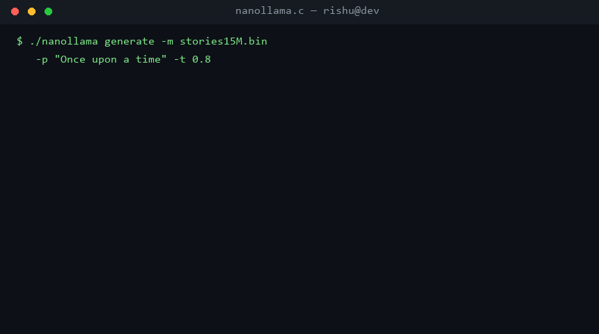
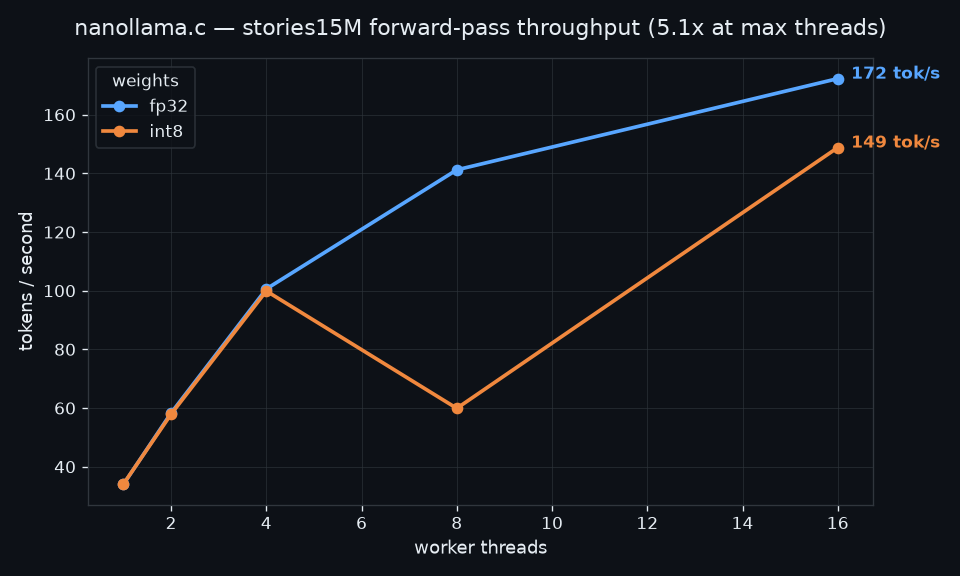

<div align="center">

# nanollama.c

**A complete LLM inference engine in ~1,400 lines of dependency-free C.**

Transformer forward pass · BPE tokenizer from scratch · hand-rolled thread pool ·
int8 quantization · zero libraries, zero OpenMP, zero API keys.

[](https://github.com/Agarwalrishu13/nanollama.c/actions/workflows/ci.yml)
[](LICENSE)
[]()
[]()



*Real output, generated on the CPU by this engine, from a 15M-parameter model.*

> 🧠 **These aren't just karpathy's models.** The models running here can be
> trained by [nanobrain](https://github.com/Agarwalrishu13/nanobrain) — my
> from-scratch training pipeline (transformer + tokenizer + exporter). Engine
> and brain, both built by the same person.

</div>

---

## Why this exists

Everyone has called an LLM API. Almost nobody knows what happens between
`logits = model(x)` and the words coming out. **nanollama.c is the whole
pipeline, implemented from first principles and small enough to read in one
sitting:**

| Component | File | What you'll learn |
|---|---|---|
| Forward pass — RMSNorm, RoPE, GQA attention, SwiGLU, KV cache | `src/transformer.c` | how a Llama-2 transformer actually runs, one tensor at a time |
| Byte-pair encoding, built from raw bytes | `src/tokenizer.c` | how text really becomes token ids |
| Temperature / top-k / top-p sampling | `src/sampler.c` | how the "randomness" of LLMs works |
| A persistent thread pool (mutex + condvars/semaphores) | `src/threads.c` | why OpenMP exists, and what it does for you |
| Grouped int8 quantization | `src/transformer.c` | how models shrink 4x with minimal quality loss |
| Weight-format auto-detection | `src/transformer.c` | robust binary parsing, endianness-safe sizes |

No BLAS, no OpenMP, no build system beyond `make`, no external downloads at
compile time. If you can run `gcc`, you can run a language model on your
machine — and understand every line that makes it go.

## Quickstart

```bash
git clone https://github.com/Agarwalrishu13/nanollama.c
cd nanollama.c
make                        # O3, native CPU flags — that's the whole build

python scripts/download_models.py        # ~1 MB TinyStories model + tokenizer
./nanollama generate -m models/stories260K.bin -z models/tok512.bin \
    -p "Once upon a time"
```

Write a longer story with the 15M model:

```bash
python scripts/download_models.py 15m
./nanollama generate -m models/stories15M.bin -p "One day, a little girl" \
    -t 0.8 -n 256 -th 8
```

## Benchmarks

Measured with the built-in harness (`./nanollama bench -m models/stories15M.bin`),
forward passes only, on a 16-thread x64 CPU, GCC 6.3 `-O3`, Windows:

| threads | fp32 tok/s | int8 tok/s |
|--------:|-----------:|-----------:|
| 1  | 34.0  | 34.1  |
| 2  | 58.3  | 57.9  |
| 4  | 100.6 | 99.9  |
| 8  | 141.2 | 59.9  |
| 16 | **172.3** | 148.8 |

<div align="center"></div>

**The interesting number is 34 → 172 (5.1x).** The first version of this
engine spawned threads per matmul and was 40% *slower* than single-threaded —
49 thread spawns per token drowned the arithmetic. Replacing that with a
~150-line persistent pool (workers parked on semaphores/condvars) is what
turned the curve up. The full story is in `src/threads.c`'s header comment.

Honest notes: int8 here wins on memory (4x smaller weights) but not speed —
its dequantize loop is scalar in this conservative default build; compile with
`make avx2` on a machine that wants the 8-wide kernel. The dip at 8×int8 is
reproducible on this box (likely scheduler/thermal quirks); numbers are
forward-pass-only and will differ on your hardware — run the bench yourself.

## How it works

```
 "Once upon a time"                        BPE tokenizer (src/tokenizer.c)
        │
        ▼
   token ids [1, 9038, 2501, 284, 322, 1110, ...]
        │
        ▼
┌───────────────────────────────────────────────────────────┐
│  for each of n_layers transformer blocks:                 │
│                                                           │
│   x ── RMSNorm ──► Q,K,V projections ──► RoPE             │
│                          │                                │
│                          ▼                                │
│              attention over the KV cache                  │
│              (every token looks at every past token)      │
│                          │                                │
│   x += attention output            (residual)             │
│   x ── RMSNorm ──► SwiGLU MLP ──► x +=  (residual)        │
└───────────────────────────────────────────────────────────┘
        │
        ▼
  final RMSNorm ──► classifier ──► logits over the vocabulary
        │
        ▼
   sampler: temperature → top-k → top-p → one token  (src/sampler.c)
        │
        └──► append and repeat: that's LLM text generation
```

- `docs/ARCHITECTURE.md` — the transformer primer: every tensor, its shape,
  and why each block exists
- `docs/CODE_TOUR.md` — a guided walk through `forward()`, line by line

## Model zoo

All models run on this engine (llama2.c `.bin` format — the loader
auto-detects the weight layout, legacy and current):

| model | params | download | RAM | vibe |
|---|---|---|---|---|
| stories260K | 260K | `download_models.py 260k` | ~1 MB | it says words |
| stories15M | 15M | `download_models.py 15m` | ~60 MB | coherent little stories |
| stories42M | 42M | `download_models.py 42m` | ~170 MB | better stories |
| stories110M | 110M | `download_models.py 110m` | ~440 MB | solid TinyStories quality |

> The 260K model uses a 512-token tokenizer (`tok512.bin`); the others use the
> full 32,000-token Llama-2 tokenizer (`tokenizer.bin`). The download script
> wires this up for you.

## CLI

```
nanollama generate -m model.bin [flags]     write text
nanollama chat     -m model.bin             turn-by-turn REPL
nanollama bench    -m model.bin [--csv f]   tokens/sec sweep

-m model   -z tokenizer   -p "prompt"   -n tokens
-t temp    --topp p       -k topk       -s seed
-th threads   -q (int8 at load)   -i (interactive)
```

## Roadmap

- [ ] GGUF loader → run real Qwen/Llama models
- [ ] AVX-512 + ARM NEON kernels
- [ ] speculative decoding (draft + verify)
- [ ] train-your-own model script (PyTorch → `.bin` exporter)
- [ ] Flash-attention-style fused attention

PRs welcome — good first issues: an NEON kernel, a fuzz test for the
tokenizer, a GitHub Action that benchmarks on PRs.

## Credits & further reading

- [llama2.c](https://github.com/karpathy/llama2.c) and
  [llm.c](https://github.com/karpathy/llm.c) by Andrej Karpathy — the project
  that proved an LLM engine can be a readable C file, and the source of the
  model format and TinyStories models this repo uses
- [TinyStories](https://arxiv.org/abs/2305.07759) — proof that tiny models
  can write fluent English
- [Attention Is All You Need](https://arxiv.org/abs/1706.03762) — the original
  transformer paper

## License

MIT — see [LICENSE](LICENSE).

<div align="center">
If this taught you something about how LLMs actually work, a star helps others find it. ⭐
</div>
